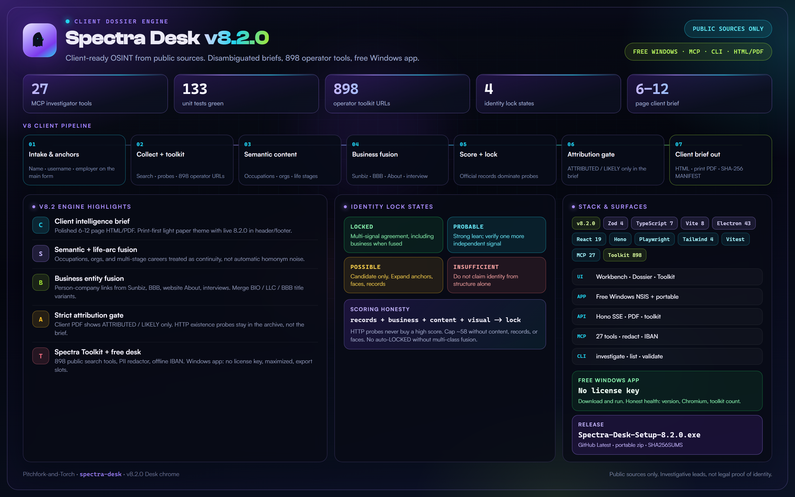
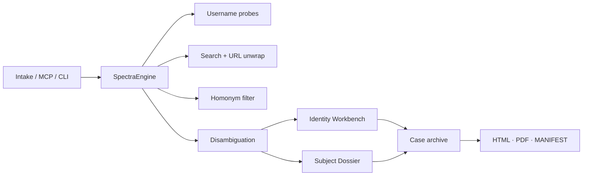

# Spectra Desk

<p align="center">
  
</p>

<p align="center">
  <strong>Client-ready OSINT from public sources.</strong><br/>
  Name, email, or username in - disambiguated, narrative, confidence-calibrated intelligence brief out.<br/>
  Plus <strong>Spectra Toolkit</strong>: 898 operator search tools · PII redactor · offline IBAN.
</p>

<p align="center">
  
  
  
  
</p>

---

## Why Spectra Desk

Common names and first-name collisions break naive OSINT. Spectra Desk **multiplies anchor signals** and **divides homonyms** before attribution - then archives every lead with SHA-256 chain of custody.

**v8 Client Dossier Engine** produces polished 6-12 page briefs: semantic life-arc clustering, business entity fusion, strict attribution (no quarantine walls), and official-record-weighted scoring. **v7 Toolkit** and **v6 multi-signal lock** remain.

| Surface | Role |
|---------|------|
| **Web console** | React intake · Identity Workbench · Dossier · portraits · **Toolkit** |
| **Windows app** | Free Electron desk · maximized · offline-capable UI |
| **API** | Hono SSE investigations · PDF · manifest · `/api/toolkit/*` |
| **MCP** | 27+ tools (dossier + toolkit pack / redact / IBAN) |
| **CLI** | `investigate` · `list` · `show` · `validate` |

**Site:** [spectradesk.jonbailey.xyz](https://spectradesk.jonbailey.xyz/)  
**Download:** [Windows installer](https://spectradesk.jonbailey.xyz/download) · [GitHub Releases](https://github.com/Pitchfork-and-Torch/spectra-desk/releases/latest)

---

## v8.2.0 - Desk chrome

Maximized window, header export slots that light when a dossier exists, Pitchfork-and-Torch credit in About and footer.

## v8.1.1 - Free Windows app

No license key. Download and run.

## v8.1.0 - Release-ready desktop

| Capability | Impact |
|------------|--------|
| **Honest health** | Version, Chromium OK, toolkit count on `/api/health` |
| **Intake** | Username + employer on the main form; Fast (12 queries) default |
| **Desktop** | Next free port if 3847 is busy; license.jonbailey.xyz first |
| **Smoke** | `npm run smoke:packaged` against the unpacked Windows build |

### v8.0.2 - Client OSINT Dossier Engine (+ print PDF)

| Capability | Impact |
|------------|--------|
| **Semantic content layer** | Occupations, orgs, life stages, consistency vs intake |
| **Business entity fusion** | Sunbiz / BBB / About / interview → owner attribution (merge BIO/LLC/BBB variants) |
| **Life-timeline narrative** | Multi-stage arcs (sports → career → business) as continuity |
| **Strict attribution gate** | Client PDF omits existence-only username probes; no auto-LOCKED without multi-class fusion |
| **Print-first client PDF** | Light paper theme, system fonts, live version in header/footer |
| **Recalibrated scoring** | Official records + business dominate probe counts |
| **Client report template** | Executive summary · identity · business · timeline · gaps · custody |
| **Single version source** | `server/src/version.ts` + package.json drive API, MCP, Electron About, reports |

See **[docs/v8/](docs/v8/)** · Dustin regression: `server/src/__tests__/v8-dustin-regression.test.ts`

### v7 Spectra Toolkit (retained)

898 operator tools · PII redactor · IBAN · packs - **[docs/v7/](docs/v7/)** · `node scripts/import-exploratores-catalog.mjs`

### v6 Dossier Engine (retained)

Moniker engine · deep profiles · portrait quality · identity lock · RIS · public-record dorks - **[docs/v6/](docs/v6/)**

### v5.1 foundations (retained)

Bing/Google unwrap · first-name collision filter · LinkedIn professional pivot · SHA-256 custody

---

## Features

| Feature | Description |
|---------|-------------|
| **Anchor disambiguation** | Username, email, domain anchors with explainable score breakdown |
| **Homonym filtering** | Entertainment / fandom / first-name collisions excluded when anchors don't match |
| **Query multiplication** | Modes: `full` (24) · `fast` (12) · `validation` (8) |
| **Parallel + cached search** | Concurrent HTTP stack + Playwright · 24h query cache · retry/backoff |
| **Username probe grid** | GitHub, Reddit, HN, Keybase, Dev.to + Sherlock-scale HTTP sites |
| **Identity Workbench** | Confirm TARGET, exclude/merge candidates (UI + MCP) |
| **Subject Dossier** | Client narrative brief · business · life timeline · gaps · notes |
| **Persona / life-arc clustering** | Multi-stage careers unified when continuity signals support it |
| **Portrait disambiguation** | dHash similarity vs anchor · subject / homonym / reject |
| **Media timeline** | Press/media chronology with tone tags |
| **Evidence archive** | SHA-256 captures · client `REPORT.html` · `MANIFEST.json` · PDF |
| **Signal fusion** | Cross-corroborates records ↔ business ↔ location across sources |
| **Spectra Toolkit** | 898 public search tools · PII redactor · IBAN · operator packs |

---

## Quick start

```bash
npm run install:all
npx playwright install chromium --prefix server
npm run dev
```

| Service | URL |
|---------|-----|
| UI | http://localhost:5173 |
| API | http://localhost:3847 |

### Windows desktop

```bash
npm run install:all
npm run dist:win
# Installer: desktop/release/Spectra-Desk-Setup-9.0.0.exe
npm run package:release
npm run smoke:packaged
```

GitHub release **v9.0.0** attaches `Spectra-Desk-Setup-9.0.0.exe`, `Spectra-Desk-Portable-9.0.0-win64.zip`, and `SHA256SUMS.txt`. Win64. Windows 10 / 11. Hashed. Unsigned. macOS and Linux are not shipped.

### CLI

```bash
npm run cli --prefix server -- intake --first Jane --last Doe --username janedoe --employer example.com --mode fast
npm run cli --prefix server -- doctor
npm run cli --prefix server -- case demo
npm run cli --prefix server -- lock --help
```

### MCP

```bash
npm run mcp --prefix server
```

Core: `investigate_subject` · `correlate_username` · `get_report` · `list_reports` · `refine_disambiguation` · `confirm_identity` · `assign_portraits` · `get_dossier` · `save_dossier_notes` · `subject_history`  

v6: `discover_monikers` · `enrich_profile` · `get_identity_lock` · `reverse_image_search` · `filter_portraits` · `public_record_dorks` · `get_moniker_inventory` · `get_deep_profiles` · `get_reverse_image_pack`

### Docker

```bash
docker compose up --build
```

---

## Architecture



Full diagram and phase table: **[ARCHITECTURE.md](ARCHITECTURE.md)**

---

## API (local)

```bash
curl -X POST http://localhost:3847/api/investigate \
  -H "Content-Type: application/json" \
  -d '{"firstName":"Jane","lastName":"Doe","email":"jane@example.com","mode":"fast"}'

curl -N -X POST http://localhost:3847/api/investigate/stream \
  -H "Content-Type: application/json" \
  -d '{"firstName":"Jane","lastName":"Doe"}'
```

---

## Testing

```bash
npm test --prefix server          # 133 unit tests
npm run test:smoke --prefix server
npm run validate --prefix server  # 6 ground-truth fixtures
```

---

## Stack

| Layer | Tech |
|-------|------|
| Frontend | React 19 · Vite 8 · Tailwind 4 |
| Backend | Hono · Playwright · Zod 4 · TypeScript 7 |
| Desktop | Electron 43 · NSIS installer |
| Agents | Model Context Protocol (stdio) |
| Storage | `~/.spectra-desk/cases/{id}/` |

---

## Environment

| Variable | Purpose |
|----------|---------|
| `SPECTRA_MODE` | Default query mode: `full`, `fast`, `validation` |
| `SPECTRA_LOG_LEVEL` | `debug`, `info`, `warn`, `error` |
| `HIBP_API_KEY` | Optional Have I Been Pwned |
| `PORT` | API port (default `3847`) |
| `FIRECRAWL_API_KEY` | Optional high-quality search fallback |

Subscription / distribution: **[DISTRIBUTION.md](DISTRIBUTION.md)**

---

## Docs

| Doc | Contents |
|-----|----------|
| [docs/v6/ARCHITECTURE-V6.md](docs/v6/ARCHITECTURE-V6.md) | Dossier Engine system design |
| [docs/v6/OPERATOR-GUIDE.md](docs/v6/OPERATOR-GUIDE.md) | Investigator workflow & lock checklist |
| [docs/v6/MIGRATION-V5-TO-V6.md](docs/v6/MIGRATION-V5-TO-V6.md) | Upgrade path from 5.1 |
| [docs/v6/GAP-ANALYSIS-DUSTIN.md](docs/v6/GAP-ANALYSIS-DUSTIN.md) | Case study that drove v6 |
| [ARCHITECTURE.md](ARCHITECTURE.md) | Pipeline overview |
| [CHANGELOG.md](CHANGELOG.md) | Version history |
| [DISTRIBUTION.md](DISTRIBUTION.md) | Desktop licensing & releases |

---

## Legal & ethical

**Public sources only.** No authenticated scraping, no login bypass, no illegal data brokers.

Investigative leads - **not** legal proof of identity.

---

## License

MIT. See [LICENSE](LICENSE). Support: GitHub Issues only.

---

<p align="center">
  <sub>Pitchfork-and-Torch · Spectra Desk v9.0.0 Corroborate · MIT · free · spectradesk.jonbailey.xyz</sub>
</p>
