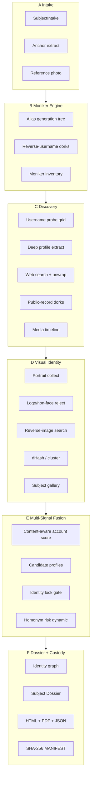

# Spectra Desk v6.0 - Dossier Engine Architecture

**Codename:** Spectra Desk Pro / Dossier Engine  
**From:** v5.1.0 · **To:** v6.0.0

---

## 1. Product contract

```
Input:  SubjectIntake (name ± middle, location, age band, employer, email, username, domain, referencePhoto)
Output: Locked multi-candidate Subject Dossier + Workbench + Graph + Timeline + Evidence Archive
Surfaces: Electron · Portable · CLI · MCP · HTML/PDF/JSON
Policy:  Public sources only · Investigative lead - not legal proof of identity
```

### Identity status (authoritative)

| Status | Rule (must all hold) |
|--------|----------------------|
| **locked** | ≥2 independent high-confidence signal classes (e.g. face cluster + unique handle content + location) AND operator confirm OR auto-lock threshold |
| **probable** | ≥2 medium+ signals, no hard contradictions |
| **possible** | Name+location or single strong public hit; incomplete |
| **insufficient** | Structural signals only (uncommon name, pivot URL, HTTP existence) |

Numeric `disambiguation.score` is **supporting evidence**, never sole lock authority.

---

## 2. Pipeline stages



### Stage ownership (modules)

| Stage | Module | Responsibility |
|-------|--------|----------------|
| B | `moniker-engine.ts` | Alias generation, ranking, reverse dorks |
| C2 | `deep-profile.ts` | Public page fetch → bio, location, avatar, links |
| C4 | `public-records-dorks.ts` | Court, business, property, news pivots (public) |
| D2 | `portrait-quality.ts` | Reject logos / default avatars |
| D3 | `reverse-image.ts` | Public RIS query builders + optional Playwright |
| D4 | `face-cluster.ts` | dHash clusters, multi-person flags |
| E | `multi-signal-scorer.ts` | Fusion log-odds, lock status |
| E | `identity-lock.ts` | Status + next actions |
| F1 | `identity-graph.ts` | Association graph (v6 edges) |

Plugin pattern: each platform implements `ProfileAdapter { probe, enrich, portraitHints }`.

---

## 3. Data model (v6 extensions)

```ts
// Core new types (see server/src/types.ts)

MonikerCandidate {
  handle: string;
  kind: "exact" | "dotted" | "initial" | "nickname" | "leet" | "reverse" | "aka" | "gaming";
  confidence: number;       // generation prior, not attribution
  sources: string[];
}

DeepProfile {
  platform: string;
  username: string;
  url: string;
  exists: boolean;
  displayName?: string;
  bio?: string;
  locationText?: string;
  avatarUrl?: string;
  website?: string;
  joinDate?: string;
  followerCount?: number;
  recentActivity?: string[];
  outboundLinks?: string[];
  extractedAt: string;
  method: "api" | "og-html" | "json-ld" | "http-probe";
  contentHash?: string;     // SHA-256 of extracted text
}

PortraitQuality {
  isLikelyFace: boolean;
  isPlatformLogo: boolean;
  rejectReason?: string;
  width?: number;
  height?: number;
}

IdentityLock {
  status: "locked" | "probable" | "possible" | "insufficient";
  score: number;            // 0-100 multi-signal
  signalClasses: string[];  // e.g. ["face-cluster","location","content-bio"]
  contradictions: string[];
  nextActions: string[];
  lockedAt?: string;
  lockedBy?: "auto" | "operator";
}

AssociationEdge {
  from: string;
  to: string;
  relation: "same-as" | "alias-of" | "mentions" | "co-occurs" | "photo-match" | "works-at" | "lives-in";
  weight: number;
  evidenceIds: string[];
}
```

Report gains:

- `monikerInventory?: MonikerCandidate[]`
- `deepProfiles?: DeepProfile[]`
- `identityLock?: IdentityLock`
- `faceClusters?: FaceCluster[]`
- `reverseImageHits?: ReverseImageHit[]`

---

## 4. Scoring formulas

### 4.1 Account posterior (content-aware)

Start from v5 log-odds prior, then:

```
if method == http-probe only:
  prior -= 1.2                    # existence is weak
if deepProfile.bio matches name tokens:
  prior += 1.5
if deepProfile.location matches intake city/state:
  prior += 1.8
if avatar passes face quality + similarity >= 0.72:
  prior += 2.2
if avatar is platform logo:
  prior -= 2.5; tier = quarantined
```

### 4.2 Multi-signal identity score

```
S = 0
+ name_rarity_bonus(last)           // 0..12
+ location_corroboration            // 0..18
+ content_attributed_accounts*8     // cap 24
+ face_cluster_quality              // 0..25
+ employment_public_hit             // 0..15
+ unique_handle_pattern             // 0..12
+ media_full_name_hits              // 0..10
- hard_contradictions               // faces/locations mismatch
```

**Lock gate (auto):** `S >= 78` AND `face_cluster` OR (`content_attributed >= 2` AND location) AND no hard contradictions.

### 4.3 Homonym risk (dynamic)

```
high   if common name OR multi face clusters OR multi cities
medium if uncommon name but no face/content
low    if face lock OR 2+ content-attributed same location
```

---

## 5. Photographic pipeline

```
collect URLs → download → portrait-quality gate
  → reject logos / 1x1 / brand marks
  → dHash + optional cluster
  → reverse-image public queries (Yandex/Google via Playwright HTML)
  → gallery ranked by face likelihood * source trust * similarity to anchor
```

### Libraries / endpoints (public)

| Component | Choice | Reliability |
|-----------|--------|-------------|
| Download / resize | `sharp` (existing) | High |
| Perceptual hash | `image-phash` dHash (existing) | Medium for faces |
| Logo reject | heuristic URL + color entropy + known CDN patterns | High for YouTube/Google defaults |
| Reverse image | Playwright → Yandex images / Google Lens public UI | Medium; captcha risk |
| Fallback | Search dorks `site:` + unavatar only for known good platforms | Medium |

**No commercial face-ID cloud required for MVP.** Optional later: local onnx face embed (documented as plugin).

---

## 6. MCP surface (v6 target ≥ 25 tools)

| Group | Tools |
|-------|-------|
| Core | investigate_subject, get_report, list_reports, refine_disambiguation |
| Identity | confirm_identity, get_identity_lock, set_identity_lock, compare_candidates |
| Alias | discover_monikers, probe_moniker, list_aliases |
| Visual | collect_portraits, reverse_image_search, assign_portraits, get_face_clusters |
| Profile | enrich_profile, deep_probe_username, get_deep_profiles |
| Graph | get_identity_graph, query_associations |
| Dossier | get_dossier, save_dossier_notes, export_dossier, get_gaps |
| History | subject_history, list_evidence, get_manifest |

---

## 7. Extensibility

```ts
interface PlatformAdapter {
  id: string;
  probe(username: string): Promise<UsernameProbe>;
  enrich?(username: string): Promise<DeepProfile | null>;
  portraitHints?(profile: DeepProfile): string[];
}
```

Register adapters in `modules/platforms/registry.ts`.

---

## 8. Failure modes (documented)

| Failure | Behavior |
|---------|----------|
| All probes HTTP-only | Mark existence-only; never "attributed" |
| No faces found | Gallery empty; status ≤ possible; next action: supply reference photo |
| RIS captcha | Fall back to dorks; log searchHealth.degraded |
| LinkedIn blocked | Keep /pub/dir + news/employer dorks; never fake /in/ content |
| Conflicting faces | status cannot lock; show multi-cluster warning |

---

## 9. Custody

Every `DeepProfile`, RIS hit, and portrait download is an evidence item:

```
type: deep-profile | reverse-image | portrait | moniker-hit
hash: SHA-256(canonical JSON or bytes)
```

MANIFEST remains concat of item hashes.

---

Public sources only · Investigative lead - not legal proof of identity.
