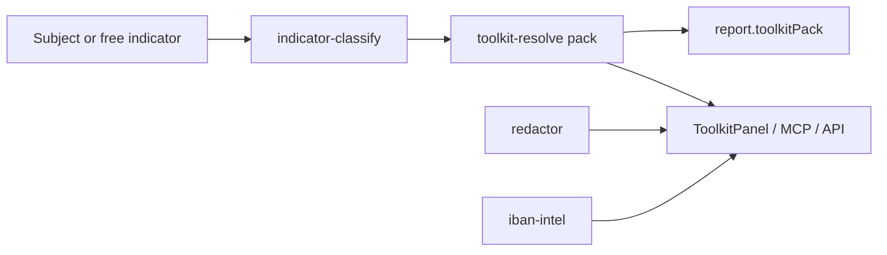

# Spectra Desk v7.0 - Toolkit Architecture

**Codename:** Spectra Toolkit  
**From:** v6.0.x Dossier Engine · **To:** v7.0.0

---

## 1. Product contract (additive)

```
v6:  SubjectIntake → multi-signal dossier + identity lock
v7+: SubjectIntake → dossier  +  Toolkit operator surface
     Freeform indicator → classified → 898 public search URL pack
     Case text → local PII redaction map → safe external AI handoff
     IBAN → offline mod-97 validate + public search links
```

Policy unchanged: **public sources only · investigative lead - not legal proof**.

---

## 2. What landed from Exploratores

[Exploratores](https://github.com/SOsintOps/Exploratores) (SOsintOps, AGPL-3.0) is a static browser OSINT toolkit: curated search buttons, PII Redactor, IBAN tool, embedded CyberChef.

Spectra Desk is proprietary (`UNLICENSED`). We **do not copy AGPL application code**. We **reimplemented capabilities natively**:

| Exploratores capability | Spectra v7 module | Notes |
|-------------------------|-------------------|--------|
| SearchLibrary (~898 tools) | `data/toolkit-catalog.json` + `toolkit-catalog.ts` | Factual public URL catalog; import script |
| data-search-id dispatcher | `toolkit-resolve.ts` | Server-side URL fill + operator packs |
| Validators / indicator routing | `indicator-classify.ts` | Email, phone, domain, IP, IBAN, crypto, VIN, name... |
| Redactor | `redactor.ts` | Numbered placeholders + map + restore + CSV |
| IBAN checker | `iban-intel.ts` | ISO 13616 mod-97 offline |
| Per-page HTML toolkit UI | `ToolkitPanel.tsx` + REST API | In-app modal workbench |
| CyberChef embed | *deferred* | Apache-2.0; optional Phase 2 embed under Tools |
| Offline bank name DBs | *deferred* | Optional Phase 2 data import |

**Attribution:** catalog source notes credit Exploratores / SOsintOps / Ramingo. See `THIRD-PARTY-TOOLKIT.md`.

---

## 3. Pipeline addition



Investigations automatically attach `toolkitPack` (ready operator links) early in the engine run.

---

## 4. Surfaces

| Surface | Path |
|---------|------|
| REST | `/api/toolkit/*` (stats, tools, resolve, classify, redact, restore, iban) |
| MCP | `list_toolkit_tools`, `toolkit_pack`, `resolve_toolkit_url`, `classify_indicator`, `redact_pii`, `restore_pii`, `analyze_iban`, `get_toolkit_pack` |
| GUI | Floating **Toolkit** button → Search pack / PII Redactor / IBAN |
| Catalog refresh | `node scripts/import-exploratores-catalog.mjs [path]` |

---

## 5. Catalog groups

`search` · `identity` · `web` · `social` · `geo` · `media` · `finance`

Categories mirror Exploratores pages: domains, usernames, names, email, phoneus/phoneint, facebook, instagram, linkedin, x, vk, maps, images, videos, publiccompanyrecords, currencies, vehicles, iban, ...

---

## 6. Non-goals (v7.0)

- Shipping AGPL Exploratores HTML as a Spectra submodule
- Auto-opening hundreds of browser tabs during investigation
- Broker / paid API pivots
- Full CyberChef embed (Phase 2)

---

## 7. Version

Engine / MCP / API / packages: **7.0.0**
