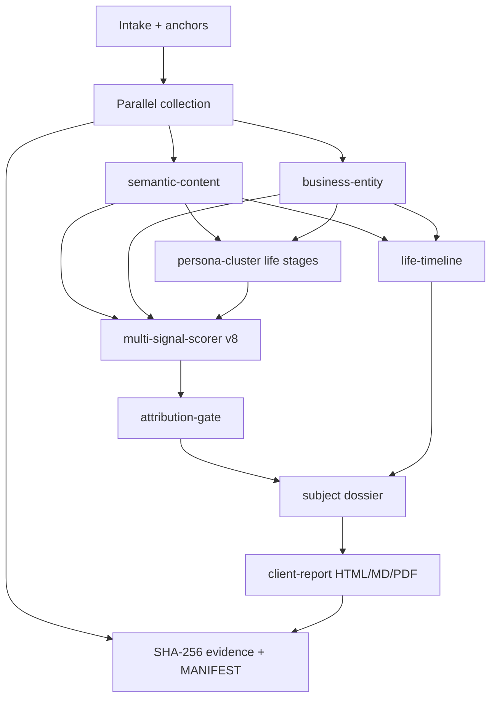

# Spectra Desk v8.0 - Client OSINT Dossier Engine

**Codename:** Exceptional Client Brief  
**From:** v7.0 Toolkit · **To:** v8.0.0 Disambiguation-first client deliverable

---

## 1. Product contract

```
v7:  SubjectIntake → multi-signal dossier + toolkit (investigator-heavy, probe-noisy)
v8+: SubjectIntake → semantic fusion → persona life-arc → business resolution
     → strict attribution gate → 6 - 12 page CLIENT brief (primary HTML/PDF)
     + full evidence archive + optional investigator appendix
```

Policy unchanged: **public sources only · investigative lead - not legal proof**.

---

## 2. Why v8 (Dustin Daprizio class failures)

| Failure in v7 sample | v8 fix |
|---------------------|--------|
| 31 pages of QUARANTINED 9% probes | Attribution gate: main report = ATTRIBUTED/LIKELY only |
| Identity never locked; BIO Scene Care "possible" + garbled FAQ employment | Business entity fusion (Sunbiz/BBB/About/interview) |
| MMA ESPN ranked as top noise / un-unified | Semantic life stages + continuity scoring (positive uniqueness) |
| Score inflated by probe count | Official-record + business dominate; HTTP probes ignored for score |
| No life narrative | `life-timeline` + client executive narrative |
| Wrong LinkedIn homonyms mixed in | Semantic demotion of name-collision candidates |

---

## 3. Pipeline (v8 additions)



---

## 4. New modules

| Module | Path | Role |
|--------|------|------|
| Semantic content | `server/src/modules/semantic-content.ts` | Occupations, orgs, stages, consistency/mismatch, continuity |
| Business entity | `server/src/modules/business-entity.ts` | Person↔company fusion (Sunbiz, BBB, About, interview) |
| Life timeline | `server/src/modules/life-timeline.ts` | Chronological persona narrative |
| Attribution gate | `server/src/modules/attribution-gate.ts` | Main vs appendix split; org name sanitize |
| Client report | `server/src/modules/client-report.ts` | Polished 7-section client HTML + MD |

Upgraded: `multi-signal-scorer`, `persona-cluster`, `dossier`, `engine` (primary export = client brief).

---

## 5. Client report structure

1. Cover / confidence tier (LOCKED · PROBABLE · POSSIBLE · INSUFFICIENT)  
2. Executive summary  
3. Identity confirmation & life stages  
4. Professional & business profile  
5. Public records & life timeline  
6. Digital footprint (high confidence only)  
7. Gaps & next steps  
8. Evidence integrity (manifest hash)  
9. Legal footer (every page sticky bar)

Unverified username probes: **archived, not in primary body**.

---

## 6. Scoring components (v8)

| Component | Weight emphasis |
|-----------|-----------------|
| Official records (Sunbiz, BBB, arrest) | High |
| Business entity fusion | High |
| Semantic content / occupations | Medium-high |
| Life-stage continuity | Medium (positive for multi-arc) |
| Visual / face | Medium-high when present |
| Deep profile content | Medium |
| HTTP existence probes | **Zero** toward attribution score |
| LinkedIn directory pivot alone | Low structural only |

Structural-only still capped (~58) when no content/records/business/visual.

---

## 7. Regression fixture

`server/src/__tests__/v8-dustin-regression.test.ts`

Success criteria (synthetic Dustin corpus):

- BIO Scene Care ≥ likely/attributed  
- MMA in life arc, continuity ≥ 20  
- ≥30 probes in appendix  
- Client MD contains BIO Scene Care, no "QUARANTINED 9%" wall  
- Garbled employment strings rejected  

---

## 8. Surfaces

| Surface | v8 behavior |
|---------|-------------|
| Engine HTML export | **Client brief** (not probe tables) |
| Markdown export | Client brief |
| PDF | Renders client HTML |
| Workbench / MCP | Full `OsintReport` still has probes, gate stats, semantic, businesses |
| Toolkit (v7) | Unchanged |

---

## 9. Version

Engine / brand / packages: **8.0.0**
